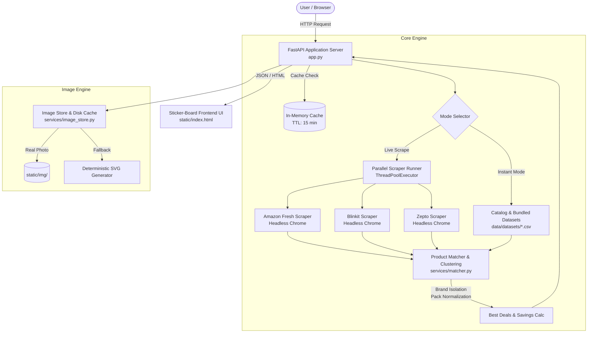

# ⚡ QuickCompare — Quick Commerce Price Comparison Engine

[](https://www.python.org/downloads/)
[](https://fastapi.tiangolo.com)
[](https://www.selenium.dev/)
[](https://www.uvicorn.org/)
[](https://opensource.org/licenses/MIT)

> **Real-time price comparison and best-deal finder across Blinkit, Zepto, and Amazon Fresh.**  
> Matches products across quick-commerce platforms using intelligent brand isolation, unit normalization, and pack-size equivalence.

---

## 🌟 Key Highlights

- **Multi-Store Comparison**: Simultaneously checks **Blinkit**, **Zepto**, and **Amazon Fresh**.
- **Intelligent Deal Matcher**:
  - **Fuzzy Token Matching**: Normalizes product variations, word orders, and casing.
  - **Brand Isolation**: Strict brand boundary enforcement prevents cross-brand false positives (e.g., Amul will never match Mother Dairy).
  - **Pack Size & Unit Normalization**: Converts `kg ↔ g`, `L ↔ ml`, handles multi-packs (`2 x 500 ml`), and isolates count/pieces (`4 pcs`).
  - **Off-Topic & Sponsored Item Filtering**: Filters out sponsored junk and unrelated catalog items (e.g., chips/namkeen never leak into "milk" results).
- **Dual-Layer Architecture**:
  - **Instant Catalog Engine**: Instant sub-millisecond responses for core grocery categories using bundled datasets and synthetic catalogs.
  - **Live Headless Scraper**: Parallel multi-threaded Selenium scrapers running headless Chrome for real-time live site pricing.
- **Visual Product Experience**:
  - Scraped, cached real product photos indexed by SHA-256 content hashes.
  - Deterministic SVG badge generator fallback for missing imagery.
- **Modern Sticker-Board UI**:
  - Cyber-editorial sticker board aesthetic with dark/light themes.
  - Price difference callouts, savings percentage tags, and direct store search links.
- **Production-Ready**:
  - Clean modular architecture, fully typed Pydantic models, in-memory caching, comprehensive test suite, and OpenAPI Swagger documentation (`/docs`).

---

## 🏗️ System Architecture



---

## 📁 Repository Structure

```text
Quick-commerce-price-comparison/
├── .env.example                     # Environment configuration template
├── .gitignore                       # Production gitignore rules
├── README.md                        # Project documentation & reference
├── requirements.txt                 # All dependencies (app, scrapers, testing)
├── app.py                           # FastAPI ASGI entrypoint & REST API routes
├── main.py                          # Dual-mode launcher (Web Server & CLI Query)
│
├── data/
│   ├── datasets/                    # Bundled CSV datasets (Blinkit, Zepto, Amazon)
│   │   ├── amazon_data.csv
│   │   ├── blinkit_data.csv
│   │   └── zepto_data.csv
│   └── image_index.json             # SHA-256 image cache mapping
│
├── notebooks/                       # Exploratory Data Analysis & fuzzy matching research
│   ├── comparison.ipynb
│   └── comparison_matched.ipynb
│
├── scripts/                         # Maintenance and pre-seeding utilities
│   └── seed_images.py               # Headless photo scraping CLI
│
├── services/                        # Core business logic
│   ├── __init__.py
│   ├── catalog.py                   # Catalog categories, synonyms & data loader
│   ├── matcher.py                   # Normalization, brand extraction & deal clustering
│   ├── image_store.py               # Disk cache, hash indexing & photo management
│   ├── image_scraper.py             # Headless scrapers for product photos
│   └── scrapers/                    # Live store scrapers
│       ├── __init__.py
│       ├── amazon.py                # Amazon Fresh live scraper
│       ├── blinkit.py               # Blinkit live scraper
│       ├── zepto.py                 # Zepto live scraper
│       └── runner.py                # Parallel ThreadPool executor
│
├── static/                          # Web application frontend assets
│   ├── index.html                   # Sticker-board UI
│   ├── style.css                    # Glassmorphism & editorial theme stylesheet
│   ├── app.js                       # Frontend search & client logic
│   └── img/                         # Cached scraped product photos
│
└── tests/                           # Automated test suite
    ├── __init__.py
    ├── conftest.py                  # Pytest fixtures & path resolution
    ├── test_api.py                  # FastAPI endpoint & UI tests
    └── test_matcher.py              # Brand isolation & pack size normalization tests
```

---

## 🚀 Quickstart Guide

### 1. Prerequisites
- **Python 3.10+** installed.
- **Google Chrome** installed (required for live headless Selenium scraping).

### 2. Clone & Setup Virtual Environment
```bash
# Clone the repository
git clone https://github.com/parth6878/Quick-commerce-price-comparison.git
cd Quick-commerce-price-comparison

# Create and activate virtual environment
python -m venv venv

# On Windows (PowerShell):
.\venv\Scripts\Activate.ps1
# On Linux / macOS:
source venv/bin/activate
```

### 3. Install Dependencies
```bash
pip install -r requirements.txt
```

### 4. Configure Environment (Optional)
Copy `.env.example` to `.env` to configure ports and scraper timeouts:
```bash
cp .env.example .env
```

---

## 💻 Running the Application

### Option A: Launch the Web Application (Default)
Run the server using `main.py`:
```bash
python main.py
```
Or directly with Uvicorn:
```bash
uvicorn app:app --host 127.0.0.1 --port 8000 --reload
```

- **Web Application UI**: [http://localhost:8000/app](http://localhost:8000/app) (or [http://localhost:8000/](http://localhost:8000/))
- **Interactive Swagger Docs**: [http://localhost:8000/docs](http://localhost:8000/docs)
- **ReDoc API Documentation**: [http://localhost:8000/redoc](http://localhost:8000/redoc)

---

### Option B: Terminal CLI Price Comparison
Compare grocery prices directly from your terminal:

```bash
# Instant comparison using bundled datasets & catalog
python main.py --query "milk"
python main.py --query "bread"

# Live comparison using headless Chrome browser scrapers
python main.py --query "coca cola" --live
```

**Sample Terminal Output:**
```text
======================================================================
 Quick Commerce Comparison: 'milk' (Instant Catalog)
======================================================================
[*] Retrieving from local bundled dataset & catalog...

[*] Found 11 matched deals across stores | 49 single-store items

Product                              | Pack       | Blinkit   | Zepto     | Amazon    | Best Deal      
-------------------------------------------------------------------------------------------------------
Amul Taaza Toned Milk                | 500 ml     | Rs 30     | Rs 29     | Rs 38     | Zepto (Save Rs 9)
Nestle a+ Slim Skimmed Milk          | 1 L        | Rs 99     | -         | Rs 94     | Amazon (Save Rs 5)
Nestle Milkmaid Partly Skimmed Swee  | 380 g      | Rs 134    | -         | Rs 130    | Amazon (Save Rs 4)
Mother Dairy Toned Milk              | 1 L        | Rs 77     | -         | Rs 75     | Amazon (Save Rs 2)
Amul Lactose Free Milk               | 250 ml     | Rs 26     | Rs 26     | Rs 26     | Tie (Save Rs 0)
```

---

### Option C: Pre-Seed Product Photos
Download and index high-resolution product photos from live platforms into `static/img/`:
```bash
# Seed all categories across all three stores
python scripts/seed_images.py

# Fast pass for Amazon Fresh only
python scripts/seed_images.py --stores amazon

# Seed specific categories
python scripts/seed_images.py --queries milk bread atta
```

---

## 📡 REST API Reference

| Endpoint | Method | Description |
| :--- | :---: | :--- |
| `/api/compare` | `GET` | Compares prices across stores for a given query parameter `query` |
| `/api/demo` | `GET` | Returns instant pre-matched sample deals (ideal for testing & demos) |
| `/api/health` | `GET` | Health check endpoint returning image store statistics and cache state |
| `/api/info` | `GET` | API metadata and endpoint directory |
| `/api/image` | `GET` | Generates deterministic branded SVG badges for products missing photos |
| `/api/images/stats` | `GET` | Image indexing telemetry (number of photos, unique queries) |
| `/api/images/seed` | `POST` | Asynchronously triggers background photo scraping for a query |
| `/docs` | `GET` | Interactive OpenAPI Swagger UI |

### Example API Request:
```bash
curl -X GET "http://localhost:8000/api/compare?query=milk"
```

### Example JSON Response:
```json
{
  "query": "milk",
  "cached": false,
  "summary": {
    "total_matched": 11,
    "total_single_store": 49,
    "total_products": 60
  },
  "matched_deals": [
    {
      "canonical_name": "Amul Taaza Toned Milk",
      "brand": "Amul",
      "quantity": "500 ml",
      "prices": {
        "Blinkit": 30.0,
        "Zepto": 29.0,
        "Amazon": 38.0
      },
      "lowest_price": 29.0,
      "highest_price": 38.0,
      "savings": 9.0,
      "savings_percentage": 23.7,
      "cheapest_store": "Zepto",
      "cheapest_stores": ["Zepto"],
      "store_count": 3,
      "store_details": {
        "Blinkit": { "raw_name": "Amul Taaza Toned Milk 500ml", "price": 30.0, "quantity": "500 ml" },
        "Zepto": { "raw_name": "Amul Taaza Toned Fresh Milk (500 ml)", "price": 29.0, "quantity": "500 ml" },
        "Amazon": { "raw_name": "Amul Taaza Homogenised Toned Milk, 500 ml", "price": 38.0, "quantity": "500 ml" }
      }
    }
  ]
}
```

---

## 🧪 Testing

The repository includes a comprehensive automated test suite verifying both API behavior and matching/normalization accuracy.

Run all tests:
```bash
python tests/test_api.py
python tests/test_matcher.py
```
Or with `pytest`:
```bash
pytest tests/ -v
```

### Test Suite Coverage:
1. **`test_api.py`**:
   - `test_root`: Validates `/` route resolution and API info directory.
   - `test_health`: Verifies `/api/health` status and image cache telemetry.
   - `test_demo`: Validates deal structure, savings calculation, and store aggregation.
   - `test_web_ui`: Validates static HTML, CSS, and JS delivery.
2. **`test_matcher.py`**:
   - `test_milk_dataset_with_query_relevance`: Ensures off-topic items (Namkeen, Bread) are filtered out, and verifies zero cross-brand contamination.
   - `test_bread_category`: Checks 3-store alignment across Brown Bread vs White Bread vs Atta Bread.
   - `test_beverages_variants`: Validates variant isolation (Coca-Cola Classic vs Coke Zero) and pack-size separation (300 ml vs 750 ml).
   - `test_staples_and_units`: Validates multi-pack and metric unit conversions (`kg ↔ g`, `L ↔ ml`, `pcs`).

---

## 🛡️ License

This project is licensed under the [MIT License](LICENSE).
